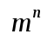
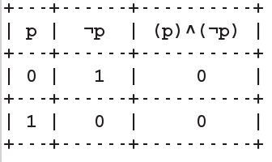
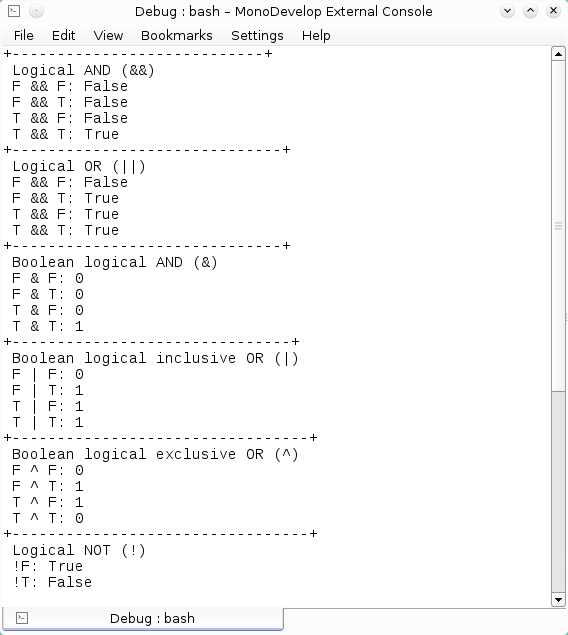

# Tablas de verdad con operadores logicos C#

El método más general para analizar los valores de verdad de las proposiciones compuestas es escribirlas en forma de una tabla. En estas tablas básicas de verdad se puede saber rápidamente si una proposición compuesta es verdadera o falsa, ya que muestra los resultados obtenidos al aplicar cada uno de los operadores lógicos, así como el resultado de la proposición de cada uno de los valores que puedan tener las diferentes proposiciones simples que integran una proposición compuesta.

Una tabla de verdad esta formada por filas y columnas, donde el número de filas depende de los posibles valores de verdad para cada proposición simple, mientras que el número de columnas depende del número de proposiciones simples que integran la proposición compuesta más el número de operadores lógicos que las conecten.

Con esto se tiene la siguiente expresión:

<pre>
    <b>Número de filas = 
		
</b>
</pre>

En donde <b>n</b> es el número de proposiciones diferentes que integran una proposición compuesta y <b>m</b> es el número de posibles valores de verdad para cada proposición.

Como ejemplo la tabla de verdad de una contradicción, una proposición es una contradicción o absurdo si al evaluarla el resultado es falso para todos los valores de verdad. La contradicción más común es <b><tt>(p)^(¬p)</tt></b> como nos muestra su tabla de verdad.

<b>Fig 1 Tabla de verdad de una contradicción.</b>
 

 

A continuación la salida de un programa que muestra las tablas de verdad de los operadores lógicos y booleanos que tiene C# para formar proposiciones compuestas a partir de proposiciones simples.

<b>Fig 2 Tablas de verdad de los operadores lógicos y booleanos en C#.</b>
 

